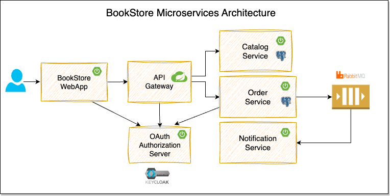

The [SpringBoot MicroService Course](https://www.youtube.com/watch?v=Ygraiu4hDJE&list=PLuNxlOYbv61g_ytin-wgkecfWDKVCEDmB) will teach you how to build a BookStore application using Spring Boot, Spring Cloud, and Docker.

&nbsp;

## Learning Objectives
* Building Spring Boot REST APIs
* Database Persistence using Spring Data JPA, Postgres, Flyway
* Event Driven Async Communication using RabbitMQ
* Implementing OAuth2-based Security using Spring Security and Keycloak
* Implementing API Gateway using Spring Cloud Gateway
* Implementing Resiliency using Resilience4j
* Job Scheduling with ShedLock-based distributed Locking
* Using RestClient, Declarative HTTP Interfaces to invoke other APIs
* Creating Aggregated Swagger Documentation at API Gateway
* Local Development Setup using Docker, Docker Compose and Testcontainers
* Testing using JUnit 5, RestAssured, Testcontainers, Awaitility, WireMock
* Building Web Application using Thymeleaf, Alpine.js, Bootstrap

## Modules
* **catalog-service**:
  This services provides REST API for managing catalog of products(books).

  **TechStack:** Spring Boot, Spring Data JPA, PostgreSQL

* **order-service**:
  This service provides the REST API for managing orders and publishes order events to the message broker.

  **TechStack:** Spring Boot, Spring Security OAuth2, Keycloak, Spring Data JPA, PostgreSQL, RabbitMQ

* **notification-service**:
  This service listens to the order events and sends notifications to the users.

  **TechStack:** Spring Boot, RabbitMQ

* **api-gateway**:
  This service is an API Gateway to the internal backend services (catalog-service, order-service).

  **TechStack:** Spring Boot, Spring Cloud Gateway

* **bookstore-webapp**:
  This is the customer facing web application where customers can browse the catalog, place orders, and view their order details.

  **TechStack:** Spring Boot, Spring Security OAuth2, Keycloak, Thymeleaf, Alpine.js, Bootstrap
